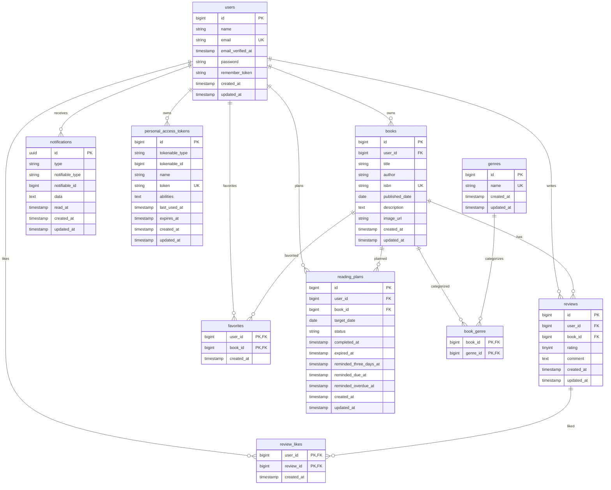

# BookShelf

BookShelfは、書籍の登録、レビュー、お気に入り、レビューへのいいね、ジャンル分類、ランキング表示、ISBN検索、読書レポート、APIトークン認証、読書計画、通知を扱う書籍レビューアプリです。

このREADMEは、実装済み機能の利用方法、データ構造、環境構築手順、APIエンドポイント、最終品質確認の観点を整理するための品質文書です。

## プロジェクトの目的

- 利用者が書籍情報を管理し、レビューを投稿できるようにする
- 気になる書籍をお気に入りとして保存できるようにする
- レビューへのいいねやジャンル分類により、書籍を見つけやすくする
- ISBN検索、読書レポート、読書計画、通知により読書管理を支援する
- APIトークン認証により、外部クライアントから書籍データを安全に操作できるようにする
- 開発・検証に必要なデータ構造と初期データを再現できるようにする

## 基本機能の概要

| 機能 | 概要 |
| --- | --- |
| ユーザー | 会員登録、ログイン、ログアウト、書籍・レビュー・お気に入り・読書計画の主体を管理する |
| 書籍 | タイトル、著者、ISBN、出版日、説明、画像URL、ジャンルを管理する |
| 検索・絞り込み・ソート | 書籍一覧でキーワード、ジャンル、並び順を指定できる |
| ISBN検索 | Google Books APIからISBNに紐づく書籍情報を取得し、登録フォームに反映する |
| ジャンル | 書籍を複数のジャンルに分類する |
| レビュー | ユーザーが書籍に評価とコメントを投稿する。1ユーザー1書籍につき1件まで登録できる |
| お気に入り | ユーザーが書籍をお気に入り登録・解除し、お気に入り一覧を確認する |
| レビューいいね | ユーザーがレビューにいいねを付ける |
| ランキング | レビュー評価をもとに書籍をTOP10で並べる |
| マイ読書レポート | 自分の登録書籍、レビュー、平均評価、評価分布、お気に入り数を確認する |
| 読書計画 | 認証ユーザーが書籍ごとに目標読了日を設定し、読了・削除・状態絞り込みを行う |
| 通知 | 読書計画の期限通知を一覧表示し、既読化する |
| 読書計画バッチ | 日次コマンドで3日前、当日、期限後通知を作成し、期限切れ計画を失効する |
| 公開API | 書籍一覧・詳細を公開し、Bearerトークン認証で書籍登録・更新・削除を行う |

## ER図

実装済みの主要テーブルは以下のとおりです。Laravel標準の `failed_jobs`、`password_reset_tokens` は省略しています。



主な制約は以下です。

- `books.user_id`、`reviews.user_id`、`reviews.book_id`、`book_genre.book_id`、`book_genre.genre_id`、`favorites.user_id`、`favorites.book_id`、`review_likes.user_id`、`review_likes.review_id`、`reading_plans.user_id`、`reading_plans.book_id` は外部キーです。
- 関連する親データが削除された場合、migrationに従って関連データはcascade deleteされます。
- `books.isbn`、`genres.name`、`users.email`、`personal_access_tokens.token` は一意です。
- `reviews` は `user_id` と `book_id` の組み合わせが一意です。
- `book_genre`、`favorites`、`review_likes` は複合主キーで重複を防止します。
- `reading_plans` は `user_id`、`book_id`、`status` の検索用インデックスを持ち、進行中計画の重複はFormRequestと保存処理で防止します。
- `notifications` はLaravel Database Notificationのpolymorphic recipientを使用します。

## 環境構築手順

### 1. プロジェクト作成

以下のDockerコマンドを実行して、Laravel 10.xを明示的に指定してプロジェクトを作成します。

```bash
docker run --rm -u "$(id -u):$(id -g)" -v "$(pwd):/var/www/html" -w /var/www/html -e COMPOSER_CACHE_DIR=/tmp/composer_cache laravelsail/php82-composer:latest composer create-project laravel/laravel:^10.0 bookshelf-app
```

プロジェクト作成後、`bookshelf-app` ディレクトリに移動し、Laravel Sailをインストールします。

```bash
cd bookshelf-app

docker run --rm -u "$(id -u):$(id -g)" -v "$(pwd):/var/www/html" -w /var/www/html -e COMPOSER_CACHE_DIR=/tmp/composer_cache laravelsail/php82-composer:latest composer require laravel/sail --dev

docker run --rm -u "$(id -u):$(id -g)" -v "$(pwd):/var/www/html" -w /var/www/html -e COMPOSER_CACHE_DIR=/tmp/composer_cache laravelsail/php82-composer:latest php artisan sail:install --with=mysql
```

M1/M2/M3 Mac（Apple Silicon）で `sail up -d` 実行時に `no matching manifest for linux/arm64/v8` エラーが発生した場合は、`compose.yaml` の `mysql` サービスに以下を追加してください。

```yaml
platform: 'linux/amd64'
```

### 2. `.env`設定

`.env` ファイルを開き、データベース接続情報が以下と一致していることを確認します。

```dotenv
DB_CONNECTION=mysql
DB_HOST=mysql
DB_PORT=3306
DB_DATABASE=laravel
DB_USERNAME=sail
DB_PASSWORD=password
```

`DB_HOST` は `localhost` や `127.0.0.1` ではなく、Dockerコンテナ名である `mysql` を指定します。

Google Books APIのISBN検索は、追加のAPIキーなしで公開エンドポイントを利用します。API認証にはSanctumを使用するため、`.env` のセッション・ドメイン設定はLaravel Sail標準構成に合わせてください。

### 3. Tailwind CSS・Alpine.jsのセットアップ

本プロジェクトでは、フロントエンドのスタイリングにTailwind CSSとAlpine.jsを使用します。Sailコンテナを起動してから、以下を実行してください。起動していない場合は `./vendor/bin/sail up -d` を実行します。

```bash
./vendor/bin/sail npm install
./vendor/bin/sail npm run dev
```

`resources/js/app.js` でAlpine.jsを読み込みます。画面操作に必要なため、Alpine.jsは削除しないでください。

### 4. phpMyAdminの設定

`compose.yaml` を開き、必要に応じて `phpmyadmin` サービスを追加してください。

```yaml
phpmyadmin:
    image: 'phpmyadmin:latest'
    ports:
        - '${FORWARD_PHPMYADMIN_PORT:-8080}:80'
    environment:
        PMA_HOST: mysql
        PMA_USER: '${DB_USERNAME}'
        PMA_PASSWORD: '${DB_PASSWORD}'
    networks:
        - sail
    depends_on:
        - mysql
```

### 5. Sail起動

```bash
./vendor/bin/sail up -d
```

必要であれば、シェルに以下のエイリアスを追加します。

```bash
echo "alias sail='[ -f sail ] && bash sail || bash vendor/bin/sail'" >> ~/.zshrc
exec $SHELL
```

### 6. アプリケーションキー生成

ルートディレクトリで以下のコマンドを実行します。

```bash
./vendor/bin/sail artisan key:generate
```

### 7. マイグレーション・Seeder実行

以下のコマンドでテーブルを作成し、初期データを投入します。

```bash
./vendor/bin/sail artisan migrate --seed
```

既存のデータベースをリセットして同じ初期データを再投入する場合は、以下を実行してください。

```bash
./vendor/bin/sail artisan migrate:fresh --seed
```

Seeder実行後の基準件数は以下です。

| テーブル | 件数 |
| --- | ---: |
| users | 5 |
| genres | 10 |
| books | 11 |
| reviews | 32 |
| favorites | 15 |
| review_likes | 24 |
| reading_plans | 6 |
| notifications | 0 |

初期ユーザーのパスワードは共通で `password` です。

#### 日本語化（バリデーション・認証メッセージ）

`config/app.php` の `locale` を `ja` にし、`lang/ja/` にメッセージファイルを手動配置して行います。

`laravel-lang/lang` などの `laravel-lang/*` 系パッケージ（`composer require laravel-lang/...`）は導入しないでください。同系パッケージは2026年5月のサプライチェーン攻撃でマルウェア配布に悪用された経緯があります。

### 8. ポート設定

必要に応じて、アプリケーション、MySQL、phpMyAdmin、Viteのポートを `.env` で変更できます。

```dotenv
APP_PORT=80
FORWARD_DB_PORT=3306
FORWARD_PHPMYADMIN_PORT=8080
VITE_PORT=5173
```

### 9. 最終確認コマンド

品質確認では以下を実行します。

```bash
./vendor/bin/sail artisan migrate:fresh --seed
./vendor/bin/sail artisan test
./vendor/bin/sail pint --test
./vendor/bin/sail artisan route:list
./vendor/bin/sail artisan test --coverage
```

カバレッジ取得にはXdebugまたはPCOVが必要です。環境にドライバがない場合は、通常のテスト結果を合格条件として扱い、取得できない理由を記録します。

## 使用技術

| 分類 | 技術 |
| --- | --- |
| バックエンド | PHP 8.1以上、Laravel 10 |
| フロントエンド | Blade、Vite、Tailwind CSS、Alpine.js |
| データベース | MySQL 8.4 |
| 開発環境 | Laravel Sail、Docker、phpMyAdmin |
| 認証 | Laravel Fortify、Laravel Sanctum |
| 外部API | Google Books API |
| テスト | PHPUnit |
| コード整形 | Laravel Pint |

## 利用方法

### Web画面

| 画面 | パス | 認証 | 概要 |
| --- | --- | --- | --- |
| 書籍一覧 | `/`、`/books` | 不要 | 書籍一覧、検索、ジャンル絞り込み、並び替え |
| 書籍詳細 | `/books/{book}` | 不要 | 書籍詳細、ジャンル、レビュー、レビューいいね数 |
| 書籍登録 | `/books/create` | 必要 | 書籍を登録する。ISBN検索結果をフォームに反映できる |
| ISBN検索 | `/books/isbn-search?isbn={isbn}` | 必要 | Google Books APIから書籍情報を取得する |
| 書籍編集 | `/books/{book}/edit` | 所有者のみ | 所有書籍を編集する |
| お気に入り一覧 | `/favorites` | 必要 | 自分のお気に入り書籍を表示する |
| ジャンル一覧・詳細 | `/genres`、`/genres/{genre}` | 必要 | ジャンル管理とジャンル別書籍一覧 |
| ランキング | `/ranking` | 不要 | 平均評価順のTOP10を表示する |
| マイ読書レポート | `/reading-report` | 必要 | 自分の読書データを集計表示する |
| 読書計画一覧 | `/reading-plans` | 必要 | 自分の読書計画を状態別に確認する |
| 通知一覧 | `/notifications` | 必要 | 自分宛ての通知を確認し、既読化する |

### 読書計画バッチ

以下のコマンドで、進行中の読書計画を処理します。

```bash
./vendor/bin/sail artisan reading-plans:process
```

処理内容は以下です。

- 目標読了日の3日前の計画に3日前通知を作成する
- 目標読了日当日の計画に当日通知を作成する
- 目標読了日を過ぎた計画に期限後通知を作成し、状態を `expired` にする
- `reminded_three_days_at`、`reminded_due_at`、`reminded_overdue_at` により重複通知を防止する

スケジューラでは `reading-plans:process` を毎日 00:00 に `withoutOverlapping()` 付きで実行します。

## APIエンドポイント一覧

| HTTPメソッド | パス | 認証 | 概要 |
| --- | --- | --- | --- |
| GET | `/api/user` | `auth:sanctum` | 認証済みユーザー情報を返す |
| POST | `/api/tokens` | 不要 | `email`、`password`、`token_name`を受け付け、SanctumのBearerトークンを発行する |
| GET | `/api/v1/books` | 不要 | 書籍一覧を取得する。`keyword`、`genre`、`sort`、`page`、`per_page`に対応する |
| GET | `/api/v1/books/{book}` | 不要 | 書籍詳細、ジャンル、レビュー投稿者名、評価、コメント、投稿日時を取得する |
| POST | `/api/v1/books` | `auth:sanctum` | 認証ユーザーを登録者として書籍を新規登録する |
| PUT/PATCH | `/api/v1/books/{book}` | `auth:sanctum` + `BookPolicy` | 所有者のみ書籍を更新できる |
| DELETE | `/api/v1/books/{book}` | `auth:sanctum` + `BookPolicy` | 所有者のみ書籍を削除できる |

### API認証

`POST /api/tokens` に認証情報を送信してBearerトークンを取得します。

```bash
curl -X POST http://localhost/api/tokens \
  -H "Accept: application/json" \
  -H "Content-Type: application/json" \
  -d '{"email":"yamada@example.com","password":"password","token_name":"local-client"}'
```

レスポンスの `token` を `Authorization` ヘッダーに指定して、書き込み系APIを呼び出します。

```bash
curl -X POST http://localhost/api/v1/books \
  -H "Accept: application/json" \
  -H "Content-Type: application/json" \
  -H "Authorization: Bearer <token>" \
  -d '{"title":"API登録書籍","author":"著者名","isbn":"9784000000999","published_date":"2020-01-01","description":"説明文","image_url":"https://example.com/cover.jpg","genre_ids":[1]}'
```

### API共通仕様

- 一覧APIはデフォルト20件、最大100件のページネーションに対応する。
- 一覧APIのレスポンスは `data`、`meta`、`links` 形式で返す。
- `sort` は `latest`、`oldest`、`title`、`rating` に対応する。
- 存在しない書籍は404、未認証の書き込みは401、所有者以外の更新・削除は403、入力エラーは422を返す。
- エラーは `message` と `errors` を含むJSON形式で返し、バリデーションメッセージは日本語で統一する。
- レスポンス整形には `BookResource`、`BookCollection`、`ReviewResource`、`GenreResource` を使用する。

## 最終品質確認

Issue #20では以下を確認対象とします。

- 全Feature Test、全Unit Test
- `migrate:fresh --seed` によるDB再構築
- Seederの件数、整合性、再現性
- ルート一覧、Blade主要画面、APIエンドポイント
- API認証、認証・認可、401、403、404、422
- Google Books APIの成功、0件、通信失敗、タイムアウト、異常レスポンス
- 読書計画の日付境界、通知重複防止、Scheduler、Command
- Pint
- 可能な場合のテストカバレッジ

## 開発環境URL

| 用途 | URL |
| --- | --- |
| アプリケーション | `http://localhost` |
| Vite開発サーバー | `http://localhost:5173` |
| phpMyAdmin | `http://localhost:8080` |

## 作成者

- 高山雄生
