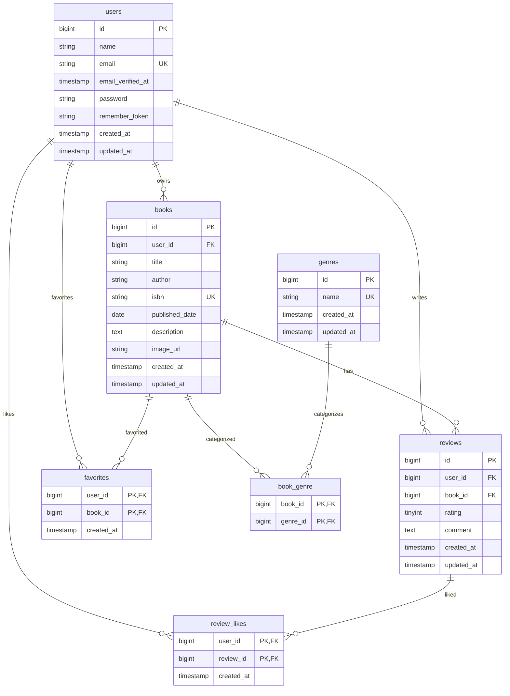

# BookShelf

BookShelfは、書籍の登録、レビュー、お気に入り、レビューへのいいね、ジャンル分類、ランキング表示を扱う書籍レビューアプリです。

このREADMEは、基本機能の開発と確認に必要なプロジェクト概要、データ構造、環境構築手順、現時点のAPIエンドポイントを整理するための品質文書の骨格です。

## プロジェクトの目的

- 利用者が書籍情報を管理し、レビューを投稿できるようにする
- 気になる書籍をお気に入りとして保存できるようにする
- レビューへのいいねやジャンル分類により、書籍を見つけやすくする
- 基本機能の開発・検証に必要なデータ構造と初期データを再現できるようにする

## 基本機能の概要

| 機能 | 概要 |
| --- | --- |
| ユーザー | 書籍、レビュー、お気に入り、レビューいいねの主体となる利用者を管理する |
| 書籍 | タイトル、著者、ISBN、出版日、説明、画像URLを管理する |
| ジャンル | 書籍を複数のジャンルに分類する | データ基盤あり |
| レビュー | ユーザーが書籍に評価とコメントを投稿する |
| お気に入り | ユーザーが書籍をお気に入り登録する |
| レビューいいね | ユーザーがレビューにいいねを付ける |
| ランキング | レビュー評価をもとに書籍を並べる |
| 公開API | 書籍情報を外部から取得・操作する |

## ER図

Issue #1で確定した基本データ構造は以下のとおりです。Laravel標準の補助テーブルは省略しています。



主な制約は以下です。

- `books.user_id`、`reviews.user_id`、`reviews.book_id`、`book_genre.book_id`、`book_genre.genre_id`、`favorites.user_id`、`favorites.book_id`、`review_likes.user_id`、`review_likes.review_id` は外部キーです。
- 関連する親データが削除された場合、Issue #1のmigrationに従って関連データはcascade deleteされます。
- `books.isbn`、`genres.name`、`users.email` は一意です。
- `reviews` は `user_id` と `book_id` の組み合わせが一意です。
- `book_genre`、`favorites`、`review_likes` は複合主キーで重複を防止します。

## 環境構築手順

### 1. プロジェクト作成

以下のDockerコマンドを実行して、Laravel 10.xを明示的に指定してプロジェクトを作成します。

```bash
docker run --rm -u "$(id -u):$(id -g)" -v "$(pwd):/var/www/html" -w /var/www/html -e COMPOSER_CACHE_DIR=/tmp/composer_cache laravelsail/php82-composer:latest composer create-project laravel/laravel:^10.0 bookshelf-app
```

プロジェクト作成後、`bookshelf-app` ディレクトリに移動し、Laravel Sailをインストールします。

```bash
cd bookshelf-app

docker run --rm -u "$(id -u):$(id -g)" -v "$(pwd):/var/www/html" -w /var/www/html -e COMPOSER_CACHE_DIR=/tmp/composer_cache laravelsail/php82-composer:latest composer require laravel/sail --dev

docker run --rm -u "$(id -u):$(id -g)" -v "$(pwd):/var/www/html" -w /var/www/html -e COMPOSER_CACHE_DIR=/tmp/composer_cache laravelsail/php82-composer:latest php artisan sail:install --with=mysql
```

M1/M2/M3 Mac（Apple Silicon）で `sail up -d` 実行時に `no matching manifest for linux/arm64/v8` エラーが発生した場合は、`compose.yaml` の `mysql` サービスに以下を追加してください。

```yaml
platform: 'linux/amd64'
```

### 2. `.env`設定

`.env` ファイルを開き、データベース接続情報が以下と一致していることを確認します。

```dotenv
DB_CONNECTION=mysql
DB_HOST=mysql
DB_PORT=3306
DB_DATABASE=laravel
DB_USERNAME=sail
DB_PASSWORD=password
```

`DB_HOST` は `localhost` や `127.0.0.1` ではなく、Dockerコンテナ名である `mysql` を指定します。

### 3. Tailwind CSS・Alpine.jsのセットアップ

本プロジェクトでは、フロントエンドのスタイリングにTailwind CSSを使用します。Sailコンテナを起動してから、以下を実行してください。起動していない場合は `./vendor/bin/sail up -d` を実行します。

#### 3.1 NPM依存パッケージのインストール

```bash
sail npm install
sail npm install alpinejs
sail npm install -D tailwindcss@^3.4.0 @tailwindcss/forms postcss autoprefixer
sail npx tailwindcss init -p
```

`@tailwindcss/forms` はフォーム要素のスタイルをリセットするLaravel標準プラグインです。

#### 3.2 Tailwind CSSの設定

`tailwind.config.js` を以下の内容で上書きしてください。

```javascript
import defaultTheme from 'tailwindcss/defaultTheme';
import forms from '@tailwindcss/forms';

/** @type {import('tailwindcss').Config} */
export default {
    content: [
        './vendor/laravel/framework/src/Illuminate/Pagination/resources/views/*.blade.php',
        './storage/framework/views/*.php',
        './resources/views/**/*.blade.php',
    ],
    theme: {
        extend: {
            fontFamily: {
                sans: ['Figtree', ...defaultTheme.fontFamily.sans],
            },
        },
    },
    plugins: [forms],
};
```

#### 3.3 Basicブランチのresourcesファイルを反映

`coachtech-prepared-file/Preparedblade-mockcase-BookShelf` リポジトリの `Basic` ブランチから `resources` ファイルを取得し、本プロジェクトの `resources` ディレクトリと入れ替えます。

#### 3.4 Vite開発サーバーの起動

```bash
sail npm run dev
```

開発中は常にこのコマンドを実行した状態にしてください。

### 4. phpMyAdminの設定

`compose.yaml` を開き、`mysql` サービスの後に以下の設定を追加してください。

```yaml
phpmyadmin:
    image: 'phpmyadmin:latest'
    ports:
        - '${FORWARD_PHPMYADMIN_PORT:-8080}:80'
    environment:
        PMA_HOST: mysql
        PMA_USER: '${DB_USERNAME}'
        PMA_PASSWORD: '${DB_PASSWORD}'
    networks:
        - sail
    depends_on:
        - mysql
```

### 5. Sail起動

```bash
./vendor/bin/sail up -d

echo "alias sail='[ -f sail ] && bash sail || bash vendor/bin/sail'" >> ~/.zshrc
exec $SHELL
```

上記の `exec $SHELL` を実行するか、新しいターミナルを開いてエイリアスを有効にします。

### 6. アプリケーションキー生成

ルートディレクトリで以下のコマンドを実行します。

```bash
sail artisan key:generate
```

### 7. マイグレーション・Seeder実行

以下のコマンドでテーブルを作成し、初期データを投入します。

```bash
sail artisan migrate --seed
```

既存のデータベースをリセットしたい場合は、以下を実行してください。

```bash
sail artisan migrate:fresh --seed
```

#### 日本語化（バリデーション・認証メッセージ）

`config/app.php` の `locale` を `ja` にし、`lang/ja/` にメッセージファイルを手動配置して行います。

`laravel-lang/lang` などの `laravel-lang/*` 系パッケージ（`composer require laravel-lang/...`）は導入しないでください。同系パッケージは2026年5月のサプライチェーン攻撃でマルウェア配布に悪用された経緯があります。

### 8. ポート設定

必要に応じて、アプリケーション、MySQL、phpMyAdmin、Viteのポートを `.env` で変更できます。

```dotenv
APP_PORT=80
FORWARD_DB_PORT=3306
FORWARD_PHPMYADMIN_PORT=8080
VITE_PORT=5173
```

### 9. 応用機能の環境拡張

基本機能の実装完了後、応用機能の画面に対応するBladeテンプレートを取得し、環境を拡張します。

1. `coachtech-prepared-file/Preparedblade-mockcase-BookShelf` リポジトリの `Advanced` ブランチから `resources` ファイルを再度インポートし、プロジェクトの `resources` ディレクトリを置き換えます。
2. 応用版データモデルの変更を適用します。マイグレーションを書き直し、`sail artisan migrate:fresh --seed` で再構築してください。変更点の詳細はシート11・12を参照してください。

## 使用技術

| 分類 | 技術 |
| --- | --- |
| バックエンド | PHP 8.1以上、Laravel 10 |
| フロントエンド | Blade、Vite、Tailwind CSS、Alpine.js |
| データベース | MySQL 8.4 |
| 開発環境 | Laravel Sail、Docker、phpMyAdmin |
| テスト | PHPUnit |
| コード整形 | Laravel Pint |

## APIエンドポイント一覧

現在の `routes/api.php` に定義されているAPIのみを記載しています。基本公開APIの `/api/v1/books` はまだ実装されていません。

| HTTPメソッド | パス | ミドルウェア | 概要 |
| --- | --- | --- | --- |
| GET | `/api/user` | `auth:sanctum` | 認証済みユーザー情報を返す |

## 開発環境URL

| 用途 | URL |
| --- | --- |
| アプリケーション | `http://localhost` |
| Vite開発サーバー | `http://localhost:5173` |
| phpMyAdmin | `http://localhost:8080` |

## 作成者

- 高山雄生
