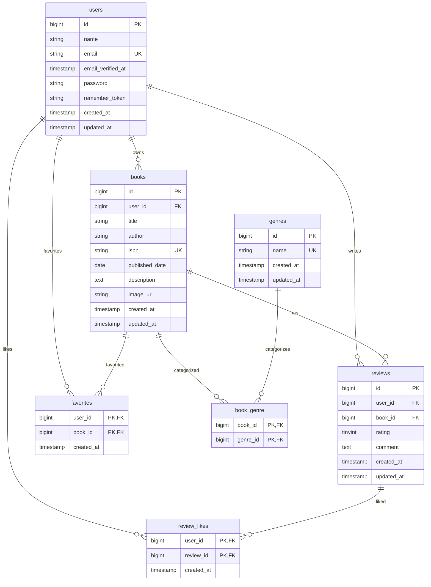

# BookShelf

BookShelfは、書籍の登録、レビュー、お気に入り、レビューへのいいね、ジャンル分類、ランキング表示を扱う書籍レビューアプリです。

このREADMEは、基本機能の開発と確認に必要なプロジェクト概要、データ構造、環境構築手順、現時点のAPIエンドポイントを整理するための品質文書の骨格です。

## プロジェクトの目的

- 利用者が書籍情報を管理し、レビューを投稿できるようにする
- 気になる書籍をお気に入りとして保存できるようにする
- レビューへのいいねやジャンル分類により、書籍を見つけやすくする
- 基本機能の開発・検証に必要なデータ構造と初期データを再現できるようにする

## 基本機能の概要

| 機能 | 概要 | 現在の状態 |
| --- | --- | --- |
| ユーザー | 書籍、レビュー、お気に入り、レビューいいねの主体となる利用者を管理する | データ基盤あり |
| 書籍 | タイトル、著者、ISBN、出版日、説明、画像URLを管理する | データ基盤あり |
| ジャンル | 書籍を複数のジャンルに分類する | データ基盤あり |
| レビュー | ユーザーが書籍に評価とコメントを投稿する | データ基盤あり |
| お気に入り | ユーザーが書籍をお気に入り登録する | データ基盤あり |
| レビューいいね | ユーザーがレビューにいいねを付ける | データ基盤あり |
| ランキング | レビュー評価をもとに書籍を並べる | 今後実装予定 |
| 公開API | 書籍情報を外部から取得・操作する | 今後実装予定 |

## ER図

Issue #1で確定した基本データ構造は以下のとおりです。Laravel標準の補助テーブルは省略しています。



主な制約は以下です。

- `books.user_id`、`reviews.user_id`、`reviews.book_id`、`book_genre.book_id`、`book_genre.genre_id`、`favorites.user_id`、`favorites.book_id`、`review_likes.user_id`、`review_likes.review_id` は外部キーです。
- 関連する親データが削除された場合、Issue #1のmigrationに従って関連データはcascade deleteされます。
- `books.isbn`、`genres.name`、`users.email` は一意です。
- `reviews` は `user_id` と `book_id` の組み合わせが一意です。
- `book_genre`、`favorites`、`review_likes` は複合主キーで重複を防止します。

## 環境構築手順

### 1. プロジェクト作成

```bash
git clone https://github.com/Takayama0422/Bookshelf.git bookshelf-app
cd bookshelf-app
composer install
npm install
```

### 2. `.env`設定

```bash
cp .env.example .env
./vendor/bin/sail artisan key:generate
```

SailでMySQLへ接続するため、`.env` のDB設定を以下のように調整します。

```dotenv
APP_NAME=BookShelf
APP_URL=http://localhost

DB_CONNECTION=mysql
DB_HOST=mysql
DB_PORT=3306
DB_DATABASE=laravel
DB_USERNAME=root
DB_PASSWORD=
```

必要に応じて、アプリケーション、MySQL、phpMyAdmin、Viteのポートを `.env` で変更できます。

```dotenv
APP_PORT=80
FORWARD_DB_PORT=3306
FORWARD_PHPMYADMIN_PORT=8080
VITE_PORT=5173
```

### 3. Sail起動

```bash
./vendor/bin/sail up -d
```

### 4. マイグレーション・Seeder実行

```bash
./vendor/bin/sail artisan migrate:fresh --seed
```

### 5. Vite起動

```bash
./vendor/bin/sail npm run dev
```

### 6. phpMyAdminの利用方法

Sail起動後、ブラウザで `http://localhost:8080` を開きます。

`compose.yaml` ではphpMyAdminの接続先が `mysql`、ユーザー名とパスワードが `.env` の `DB_USERNAME` と `DB_PASSWORD` に設定されています。

## 使用技術

| 分類 | 技術 |
| --- | --- |
| バックエンド | PHP 8.1以上、Laravel 10 |
| フロントエンド | Blade、Vite、Tailwind CSS、Alpine.js |
| データベース | MySQL 8.4 |
| 開発環境 | Laravel Sail、Docker、phpMyAdmin |
| テスト | PHPUnit |
| コード整形 | Laravel Pint |

## APIエンドポイント一覧

現在の `routes/api.php` に定義されているAPIのみを記載しています。基本公開APIの `/api/v1/books` はまだ実装されていません。

| HTTPメソッド | パス | ミドルウェア | 概要 |
| --- | --- | --- | --- |
| GET | `/api/user` | `auth:sanctum` | 認証済みユーザー情報を返す |

## 開発環境URL

| 用途 | URL |
| --- | --- |
| アプリケーション | `http://localhost` |
| Vite開発サーバー | `http://localhost:5173` |
| phpMyAdmin | `http://localhost:8080` |

## 作成者

- Takayama0422
